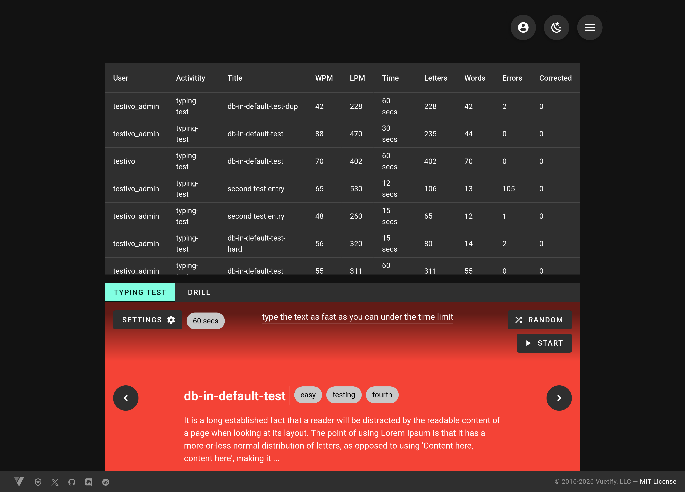

# Type Writer

speed and accuracy typing webapp - sleek interface developed with VueJS and backed up by go/echo main backend

## UI Screenshots

## Technology Stack

### FrontEnd

- js
- vue
- vuetify
- pinia
- sass

### BackEnd

- go
- echo
- gorm
- postgresql

## How To Run

### FrontEnd

**requires**:
    node package manager -- this project uses pnpm

'''bash
pnpm add
pnpm dev
visit 
'''

### BackEnd

**requires**:
    go >= 1.24,
    make 
    docker
    docker compose

'''bash
go mod tidy
make deps-install
make local
'''

## Dependencies

### FrontEnd

- js
- vue
- vuerouter
- vuetify
- pinia
- vite
- eslint
- sass
- axios

### BackEnd

- go
- go-sqlmock
- migrate
- echo
- echo-jwt
- slog-echo
- crypto
- gorm
- venom
- postgresql
- casbin
- crypto
- make
- wget
- docker
- docker compose

## Licensing

This repository is licensed under the Apache 2.0 license, see [LICENSE.txt](./LICENSE.txt) for more details.
